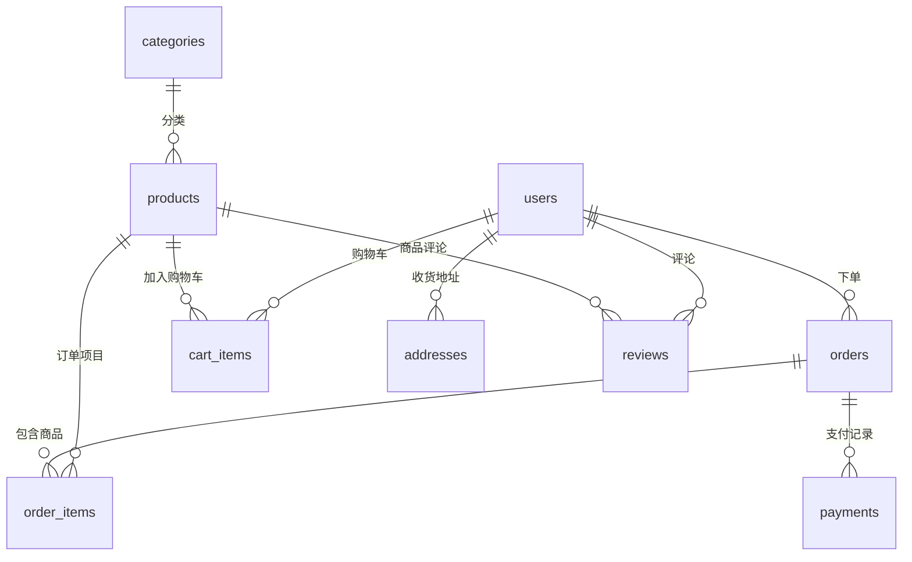

# 海鸥腕表商城数据库系统指南

## 🗄️ 系统概述

本系统采用轻量级JSON文件数据库作为起始方案，同时提供完整的迁移路径支持未来升级到MySQL、PostgreSQL等关系型数据库。系统具备完整的电商数据模型，支持用户管理、商品管理、订单处理、支付记录等核心功能。

## 📊 数据库架构

### 核心数据表

| 表名 | 描述 | 主要字段 |
|------|------|----------|
| `users` | 用户信息 | id, email, password_hash, name, phone, status |
| `products` | 商品信息 | id, name, price, sku, category_id, brand, stock_quantity |
| `categories` | 商品分类 | id, name, slug, parent_id, sort_order |
| `orders` | 订单主表 | id, user_id, order_number, status, total_amount |
| `order_items` | 订单项目 | id, order_id, product_id, quantity, price |
| `cart_items` | 购物车 | id, user_id, session_id, product_id, quantity |
| `addresses` | 收货地址 | id, user_id, province, city, district, street |
| `payments` | 支付记录 | id, order_id, amount, status, payment_method |
| `reviews` | 商品评论 | id, product_id, user_id, rating, content |
| `coupons` | 优惠券 | id, code, type, value, usage_limit |
| `settings` | 系统设置 | id, key, value, category |
| `logs` | 操作日志 | id, level, action, user_id, message |

### 数据关系



## 🚀 快速开始

### 1. 初始化数据库

```typescript
import { db } from './database/database-manager';

// 初始化数据库连接
await db.initialize();
```

### 2. 基础操作示例

```typescript
// 创建用户
const user = await db.createUser({
  email: 'user@example.com',
  password_hash: 'hashed_password',
  name: '张三',
  phone: '13800138000'
});

// 查询商品
const products = await db.findProducts({
  where: [{ field: 'status', operator: '=', value: 'active' }],
  limit: 10
});

// 创建订单
const order = await db.createOrder({
  user_id: user.id,
  order_number: 'SG20241201001',
  subtotal: 2888,
  shipping_fee: 15,
  tax_fee: 288.8,
  discount_amount: 0,
  total_amount: 3191.8,
  payment_method: 'alipay',
  shipping_address: {
    name: '张三',
    phone: '13800138000',
    province: '北京市',
    city: '北京市',
    district: '朝阳区',
    street: '建国路88号',
    postal_code: '100000',
    is_default: true
  },
  ordered_at: new Date().toISOString()
});
```

## 🛠️ 核心功能

### 用户管理

```typescript
// 用户注册
const newUser = await db.createUser({
  email: 'user@example.com',
  password_hash: await hashPassword('password'),
  name: '用户姓名',
  phone: '手机号码'
});

// 用户查询
const user = await db.findUserByEmail('user@example.com');

// 用户更新
await db.updateUser(userId, { name: '新姓名' });
```

### 商品管理

```typescript
// 商品查询
const products = await db.findProducts({
  where: [
    { field: 'category_id', operator: '=', value: categoryId },
    { field: 'status', operator: '=', value: 'active' }
  ],
  orderBy: [{ field: 'created_at', direction: 'desc' }],
  limit: 20
});

// 商品搜索
const searchResults = await db.searchProducts('海鸥机械表');

// 库存更新
await db.updateProductStock(productId, newQuantity);
```

### 订单处理

```typescript
// 创建订单
const order = await db.createOrder(orderData);

// 查询用户订单
const userOrders = await db.findOrdersByUser(userId, {
  orderBy: [{ field: 'ordered_at', direction: 'desc' }]
});

// 更新订单状态
await db.updateOrderStatus(orderId, 'paid');
```

### 购物车操作

```typescript
// 添加到购物车
await db.addToCart(userId, sessionId, productId, quantity);

// 获取购物车内容
const cartItems = await db.getCartItems(userId, sessionId);

// 清空购物车
await db.clearCart(userId, sessionId);
```

## 🔧 高级功能

### 查询构建器

```typescript
// 复杂查询示例
const expensiveWatches = await db.findProducts({
  where: [
    { field: 'price', operator: '>', value: 5000 },
    { field: 'brand', operator: '=', value: '海鸥' },
    { field: 'status', operator: '=', value: 'active' }
  ],
  orderBy: [
    { field: 'price', direction: 'desc' },
    { field: 'created_at', direction: 'desc' }
  ],
  limit: 10,
  offset: 0
});
```

### 事务处理

```typescript
// 使用事务处理复杂操作
await db.getEngine().transaction([
  {
    type: 'update',
    table: 'products',
    conditions: [{ field: 'id', operator: '=', value: productId }],
    data: { stock_quantity: newQuantity }
  },
  {
    type: 'insert',
    table: 'logs',
    data: {
      level: 'info',
      action: 'stock_update',
      entity_type: 'product',
      entity_id: productId,
      message: `库存更新为 ${newQuantity}`
    }
  }
]);
```

### 数据备份与恢复

```typescript
// 创建备份
const backupPath = await db.backup();
console.log(`备份已创建: ${backupPath}`);

// 恢复数据
await db.restore(backupPath);

// 健康检查
const isHealthy = await db.healthCheck();
```

## 📈 数据库迁移

### 从JSON迁移到MySQL

```typescript
import { DataMigrator, MigrationConfigGenerator } from './database/migrations';

// 生成MySQL配置
const mysqlConfig = MigrationConfigGenerator.generateMySQLConfig(
  'localhost',
  3306,
  'username',
  'password',
  'seagull_watch_db'
);

// 执行迁移
const migrator = new DataMigrator(currentConfig, mysqlConfig);
await migrator.migrateJsonToMySQL(currentData);
```

### 迁移脚本生成

```typescript
// 生成完整的MySQL迁移脚本
const migrator = new DataMigrator(sourceConfig, targetConfig);
const sqlScript = migrator.generateMigrationSQL(currentData);

// 保存为SQL文件
await fs.writeFile('migration.sql', sqlScript);
```

## 🔒 安全考虑

### 当前实现（JSON数据库）
- 文件级别的访问控制
- 简单的数据验证
- 基础的备份机制

### 生产环境建议
- 使用关系型数据库（MySQL/PostgreSQL）
- 实施严格的访问控制和权限管理
- 数据加密（传输和存储）
- 定期安全审计
- 完善的备份和灾难恢复计划

## 📋 性能优化

### 索引策略
系统预定义了关键字段的索引：
- 用户邮箱唯一索引
- 商品SKU唯一索引  
- 订单号唯一索引
- 外键关联索引
- 常用查询字段索引

### 查询优化
```typescript
// 使用索引友好的查询
const products = await db.findProducts({
  where: [
    { field: 'category_id', operator: '=', value: categoryId }, // 使用索引
    { field: 'status', operator: '=', value: 'active' }        // 使用索引
  ]
});

// 避免全表扫描
const searchResults = await db.findProducts({
  where: [
    { field: 'name', operator: 'like', value: keyword }        // 可能较慢
  ],
  limit: 50 // 限制结果数量
});
```

## 📊 监控与维护

### 统计信息

```typescript
// 获取数据库统计
const stats = await db.getDashboardStats();
console.log('数据库统计:', stats);
// 输出: { users: 100, products: 50, orders: 200, ... }
```

### 日志记录

系统自动记录关键操作：
- 用户注册和登录
- 订单创建和状态变更
- 支付处理
- 库存变更
- 系统错误

### 定期维护

```typescript
// 清理过期的购物车项目
await db.getEngine().delete('cart_items', [
  { field: 'updated_at', operator: '<', value: thirtyDaysAgo }
]);

// 归档历史日志
await db.getEngine().delete('logs', [
  { field: 'created_at', operator: '<', value: sixMonthsAgo }
]);
```

## 🚀 部署配置

### 开发环境
```json
{
  "type": "json",
  "filename": "database/dev-db.json",
  "autoBackup": true,
  "backupInterval": 30
}
```

### 生产环境
```json
{
  "type": "mysql",
  "host": "db.example.com",
  "port": 3306,
  "database": "seagull_production",
  "autoBackup": true,
  "backupInterval": 360
}
```

## ❓ 常见问题

### Q: 如何处理并发访问？
A: JSON数据库适合单进程访问。生产环境建议迁移到支持并发的关系型数据库。

### Q: 数据文件过大怎么办？
A: 实施数据归档策略，定期清理历史数据，或考虑迁移到关系型数据库。

### Q: 如何确保数据一致性？
A: 使用事务处理关键操作，定期执行数据完整性检查。

### Q: 备份策略是什么？
A: 自动定期备份，保留多个版本，支持手动备份和恢复。

---

*这个数据库系统为海鸥腕表商城提供了完整的数据管理功能，从轻量级JSON文件开始，为未来升级到企业级数据库做好了充分准备。* 